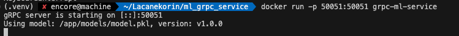

# **MLOps Homework №2**
**Автор: Мартиросова Анастасия Гургеновна**

**Модуль 2: «Реализация /health и /predict эндпоинтов в gRPC-сервисе».**

## **1. Цель проекта**

Освоение полного цикла развертывания минимального ML-сервиса — от реализации gRPC-интерфейса до контейнеризации и запуска в изолированном окружении Docker.

Сервис реализует два основных метода:
- **Health** — проверка состояния сервиса и версии модели
- **Predict** — получение предсказаний от обученной ML-модели (классификация wine dataset)


## Структура проекта

```
ml_grpc_service/
├── protos/
│   └── model.proto           # Protocol Buffers контракт API
├── server/
│   └── server.py             # Реализация gRPC-сервера
├── client/
│   └── client.py             # Тестовый клиент
├── models/
│   └── model.pkl             # Обученная модель
├── model_pb2.py              # Сгенерированный код (messages)
├── model_pb2_grpc.py         # Сгенерированный код (services)
├── requirements.txt          # Зависимости Python
├── Dockerfile                # Конфигурация Docker-контейнера
├── .dockerignore             # Исключения для Docker
└── README.md                 # Документация
```


## **2. Локальный запуск проекта**

1. Клонирование репозитория
```
git clone https://github.com/Lacanekorin/mlops_hw2_Martirosova_Anastasia.git
cd mlops_hw2_Martirosova_Anastasia
```

2. Настройка окружения  

```bash
python -m venv .venv
source .venv/bin/activate  
# Windows: .venv\Scripts\activate
pip install -r requirements.txt
```

3. (Опционально) Генерация gRPC-кода

```bash
python -m grpc_tools.protoc -I./protos --python_out=. --grpc_python_out=. ./protos/model.proto
```

4. Запуск сервера 

```bash
python -m server.server
```

Ожидаемый вывод:
```
gRPC server is starting on [::]:50051
Using model: /Users/encore/Lacanekorin/ml_grpc_service/models/model.pkl, version: v1.0.0
```

5.  Запуск клиента

В другом терминале:

```bash
# export CUSTOM_LOCALHOST='127.0.0.1' (опционально для MacOs)
python -m client.client
```

Ожидаемый вывод:
```
[Health] status=ok, model_version=v1.0.0
[Predict] prediction=0, confidence=0.999, model_version=v1.0.0
```

## **3. Запуск проекта в Docker**

1.  Сборка образа

```bash
docker build -t grpc-ml-service .
```

2.  Запуск контейнера

```bash
docker run -p 50051:50051 grpc-ml-service
```

3.  Проверка работы контейнера

```bash
grpcurl -plaintext localhost:50051 mlservice.v1.PredictionService.Health 
```

## **4. Скриншоты**

### Запуск сервера в Docker

```bash
docker run -p 50051:50051 grpc-ml-service
```


### Тестирование через grpcurl

**Health:**
```bash
grpcurl -plaintext localhost:50051 mlservice.v1.PredictionService.Health
```

**Predict:**
```bash
python -m client.client
```


